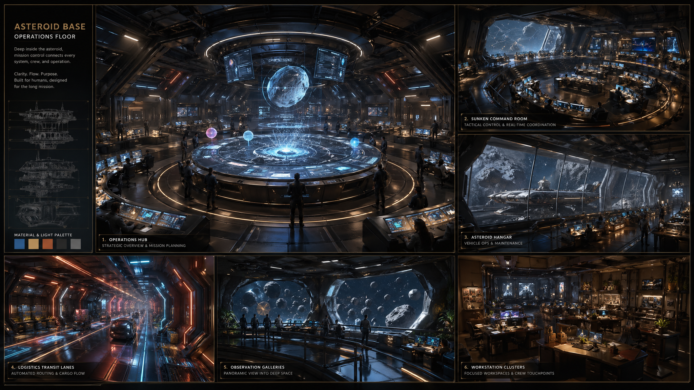
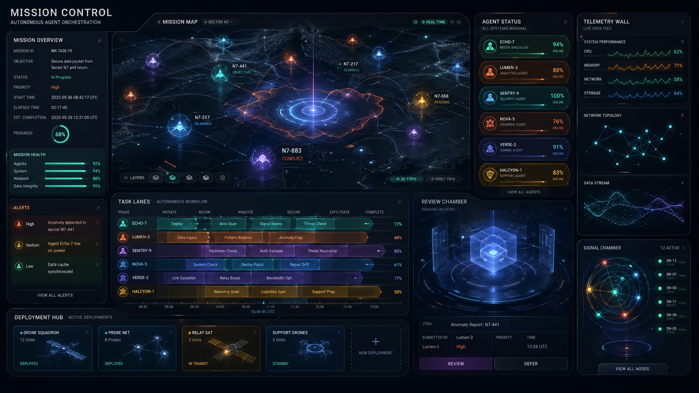
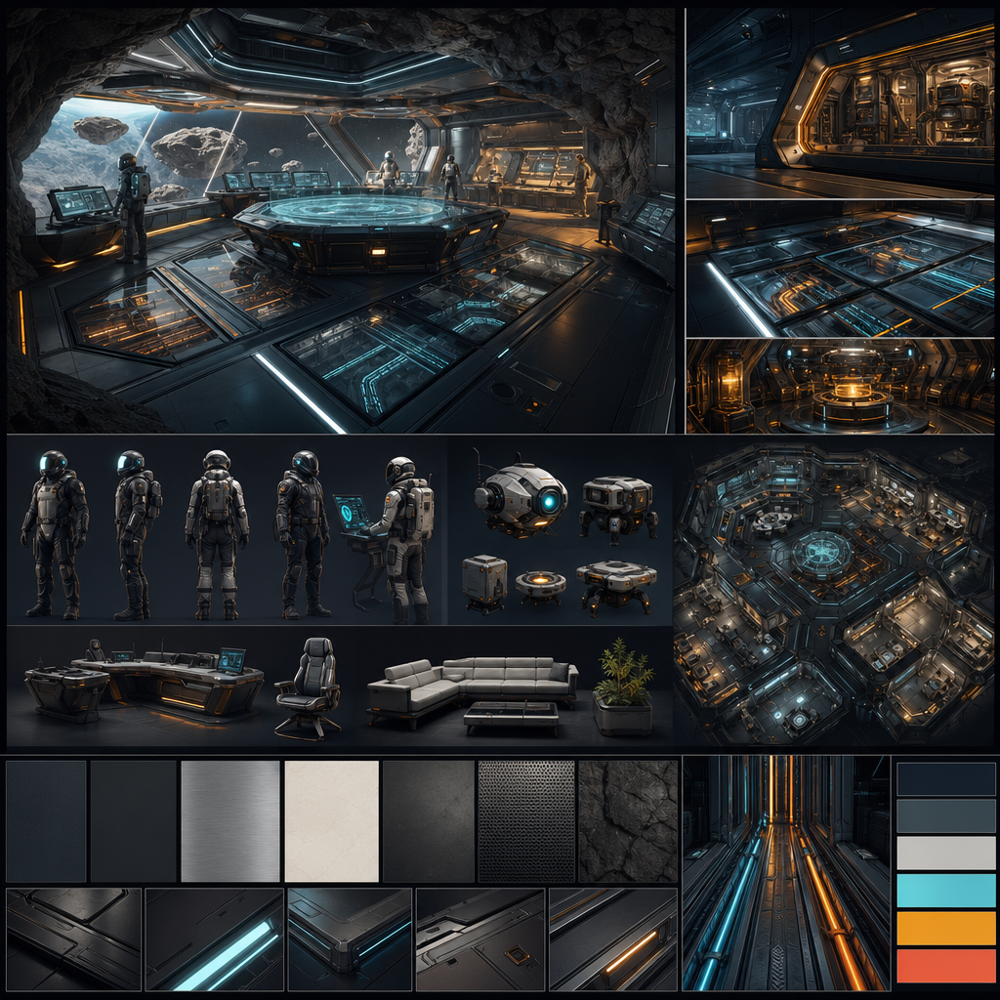

# Mission Control 3D World — Mood / Design / Inspiration Board

Mission Control should not become a generic spaceship bridge. The target is an **asteroid-base operations floor**: part command room, part shipyard, part autonomous-agent hive.

## North Star

**Star Atlas polish + Star Citizen spatial richness + NASA/JPL operational clarity.**

Use references for mood, composition, lighting, and systems language — not for copying ships, brands, logos, or exact UI.

---

## Board 1 — World Architecture + Cinematic Lighting

**Design takeaways**
- Central holographic mission table as the anchor.
- Sunken command floor with visible workstations around it.
- Rear panoramic window / asteroid hangar view for scale.
- Glowing logistics lanes embedded in floor panels.
- Strong blue/cyan base lighting with amber operational highlights and coral alert states.
- Human-scale details matter: rails, steps, consoles, chairs, cable channels, maintenance bays.

**Reference pool**
- Star Atlas homepage / brand world: https://staratlas.com/
- Star Atlas YouTube channel: https://www.youtube.com/@StarAtlasGame/videos
- Star Atlas Showroom R2.1 Trailer: https://www.youtube.com/watch?v=uFE0YPo-iHk
- Star Atlas Unreal Engine 5 Trailer: https://www.youtube.com/watch?v=UbDPNGCCfRQ
- Star Atlas UE5 Showroom references: https://www.youtube.com/results?search_query=Star+Atlas+Unreal+Engine+5+Showroom
- Star Citizen official site: https://robertsspaceindustries.com/star-citizen
- Star Citizen official YouTube: https://www.youtube.com/@RobertsSpaceInd/videos
- Star Citizen location tours: https://www.youtube.com/results?search_query=Star+Citizen+Orison+New+Babbage+Area18+tour

---

## Board 2 — Holographic UI + Operational Systems

**Design takeaways**
- UI should feel volumetric and spatial, not pasted-on HUD soup.
- Missions become glowing lanes / nodes / containers in-world.
- Agents get status capsules and load indicators above or beside them.
- Review work should look like containment / inspection chambers.
- Deployments should look like launch lanes, not just buttons.
- Keep it readable: thin lines, restrained glow, large typography, obvious hierarchy.

**Reference pool**
- NASA/JPL mission control imagery search: https://www.nasa.gov/images/
- NASA image library search — mission control: https://images.nasa.gov/search-results?q=mission%20control
- EVE Online tactical / galaxy UI references: https://www.youtube.com/results?search_query=EVE+Online+galaxy+map+fleet+UI
- Destiny HELM / Tower social hub references: https://www.youtube.com/results?search_query=Destiny+2+HELM+Tower+social+space
- Sci-fi command center environment art: https://www.artstation.com/search?sort_by=relevance&query=sci-fi%20command%20center
- Holographic operations room searches: https://www.artstation.com/search?sort_by=relevance&query=holographic%20operations%20room

---

## Board 3 — Materials + Operator Avatars

**Design takeaways**
- Materials: graphite metal, frosted glass, brushed steel, luminous fiber/cable lanes, amber machine cores.
- Operators should be readable silhouettes first, detail second.
- Avoid full humanoid uncanny valley early. Use stylized suited operators, drones, or capsule avatars.
- Give each agent role a color/shape language:
  - Artemis: cyan / command / orchestration
  - Forge: amber / builder / fabrication
  - Sentinel: coral / QA / containment
  - Quartermaster: green / deployment / logistics
  - Prospector: violet / research / signal mining
- Avatars should animate subtly: idle, inspect, route, review, deploy.

**Reference pool**
- Star Citizen ship interiors / hangar expo searches: https://www.youtube.com/results?search_query=Star+Citizen+ship+interior+hangar+expo
- Star Citizen city/interior references: https://www.youtube.com/results?search_query=Star+Citizen+New+Babbage+Orison+interior+tour
- Mass Effect Normandy / Citadel command-space references: https://www.youtube.com/results?search_query=Mass+Effect+Normandy+Citadel+interior+design
- The Expanse ship interiors / grounded sci-fi references: https://www.youtube.com/results?search_query=The+Expanse+ship+interior+design
- Industrial sci-fi environment art: https://www.artstation.com/search?sort_by=relevance&query=industrial%20sci-fi%20interior

---

## Practical Style Rules for Mission Control

### Do
- Build an asteroid-base operations floor, not a generic bridge.
- Use 3D space to explain work state.
- Make every visual effect map to a real system state.
- Keep the camera cinematic but controlled.
- Design with modular GLB assets in mind.
- Use the web constraints as a style: clean silhouettes, stylized detail, efficient geometry.

### Don’t
- Copy Star Atlas or Star Citizen ships/UI directly.
- Overload the scene with neon noise.
- Make the agents too realistic too early.
- Hide functionality behind visual spectacle.
- Build a giant open world before the core room works.

---

## First Production Art Pass

1. Central holo-table with animated mission graph.
2. Modular command-room shell: floor, rear wall, side bays, window/hangar.
3. Four role zones:
   - Build Floor
   - Review Chamber
   - Deploy Dock
   - Observatory / Signal Room
4. Five operator avatars with strong silhouettes.
5. Ambient motion kit: signal orbs, pulsing lanes, monitor scanlines, drone path.
6. Color/material pass: graphite shell, cyan core, amber work, coral alerts, violet research.

